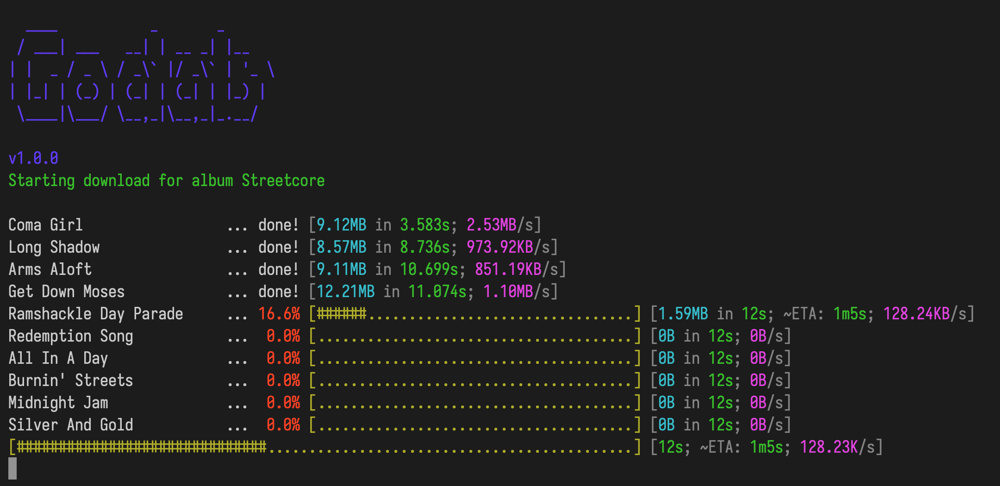

# Godab



A [dabmusic](https://dabmusic.xyz) CLI downloader written in go.

## Usage

You can download any album or track using the following commands

### First export needed env variables
For MAC and Linux
```sh
export DAB_ENDPOINT=<DAB_ENDPOINT>
export DOWNLOAD_LOCATION=<LOCATION>
```
For Windows
```sh
set DAB_ENDPOINT=<DAB_ENDPOINT>
set DOWNLOAD_LOCATION=<LOCATION>
```

Like in the following example:

```sh
export DAB_ENDPOINT=https://dabmusic.xyz
export DOWNLOAD_LOCATION=.
```

### Login to your user account

```sh
go run main.go login <EMAIL> <PASSWORD>
```

### Downloading

```sh
# ALBUM
go run main.go album <ALBUM_ID>

#TRACK
go run main.go track <TRACK_ID>

#ARTIST
go run main.go artist <ARTIST_ID>
```

You can also specify the file format (i.e audio quality) using the `--format` arg as follows

```sh
go run main.go track <TRACK_ID> --format <MP3|FLAC>
```

### Searching

You can use the `search` command to look for tracks, albums or artists

```sh
go run main.go search <QUERY> --type <TRACK|ALBUM|ARTIST>
```

## Build

In order to create a binary from the given source you can use

```sh
$ go build
$ ./godab
```

Otherwise you can always run it directly with

```sh
$ go run main.go
```

N.B: Remember that you always have to define two env variables

- DOWNLOAD_LOCATION: to specify the location where you want your files to be downloaded
- DAB_ENDPOINT: url of the `dab.yeet` domain you want to hit